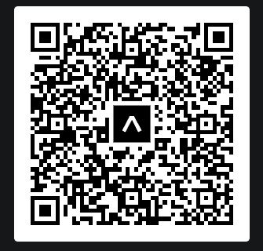

### How to test the app?

- You need to download the [Expo](https://play.google.com/store/apps/details?id=host.exp.exponent&hl=en&gl=US) App in your mobile.
- Sign up account [here](https://expo.dev/signup) and download the Expo App [Here](https://play.google.com/store/apps/details?id=host.exp.exponent&hl=en&gl=US).
- Scan the [QRCode](https://expo.dev/@clockwize171/nft-marketplace?serviceType=classic&distribution=expo-go) through Expo App via your account.

# Expo QR code

